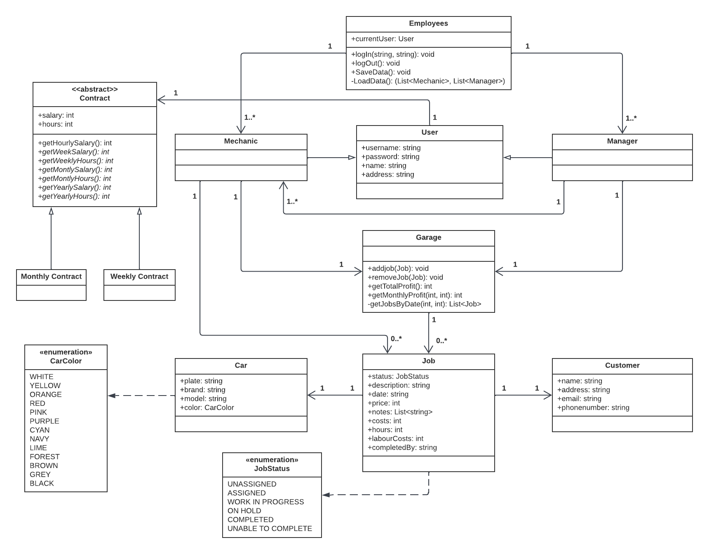
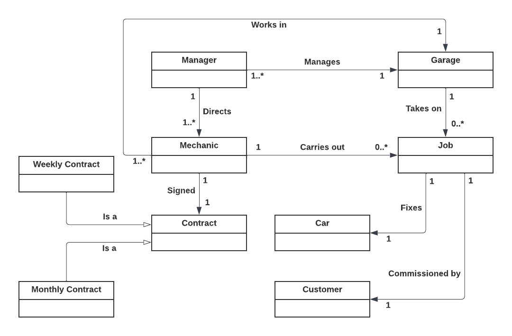

# .NET Garage App

Windows Forms .NET application to showcase my ability to analyse, design and programm functional, object oriented software.

## Class diagram

## Domain diagram

The domain diagram displays all tangible parts within a garage and expresses the relationships of these instances with each other. This diagram was used as a guideline to structure the class diagram.

## About

The purpose of the program is to assist in the workflow of a general garage, as it serves as a tool for registering new tasks and distributing them among the working mechanics within a garage. The program distinguishes between a mechanic and a manager. Both can register a new task with an associated customer and vehicle and a manager must assign it to a mechanic. All mechanics are able to view and complete all tasks assigned to themselves.

To explain the structure of the application, the application consists of one central class, the 'Employees' class, which aims to keep track of the current user. This class uses the singleton design pattern, which ensures that there can only be a single, static instance of the object, and is also the class that serves as the connection point between the program and the graphical user interface. Furthermore, this class contains all possible users. The current user is set when it has authorized itself via a login screen, after which the corresponding functionalities flow downstream from this object. In this way, the corresponding functionalities of the mechanic and managers are assigned and remain completely separated.

## Requirements
-	As a manager I want to be able to register a new job to the garage for a car form a customer, so that it can be assigned to a mechanic.
-	As a mechanic I want to be able to register a new job to the garage for a car from a customer, so that a manager could assign the job.
-	As a manager I want to be able to assign any job to a mechanic, so that the workload can be divided between mechanics.
-	As a mechanic I want to be able to change the status of a job that is assigned to me, so that I can check off my work. 
-	As a mechanic I want to be able to report the number of hours that I have spent working on a job, on its completion, so that the managers can calculate the profit of each job.
-	As a mechanic I want to be able to report the additional material costs that are associated with a job, on its completion, so that the managers can calculate the profit of each job.
-	As a mechanic I want to add notes to a job that has been assigned to me, so that I can keep a log of the job’s particularities.
-	As a manager, I want to be able to print a receipt for the customer when my car’s job has been completed, so that the customer can see what service has been done and what it cost him.
-	As a manager I want to be able to set the contract of any mechanic, so that they can keep working when their contract expires. 
-	As a manager I want to be able to calculate the garage’s profit, so that I can see whether the business is running well.
-	As a manager I want to be able to see the garage’s profit displayed in an overview separated by month and year, so that I can easily see and show other people whether the business is running well. 
